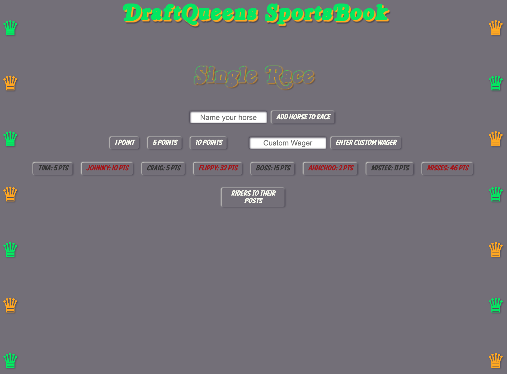

# Run the Horses

## Date: 07/08/2022

### By: Steve Morello

[GitHub](https://github.com/scubastove4) | [LinkedIn](https://www.linkedin.com/in/stephen-morello/) | [Twitter](https://twitter.com/scubastove4) | [Trello](https://trello.com/b/3arBzRBG/kentucky-derby-7-8-22)

---

## **_Description_**

Run the Horses is the first project I completed as a student in the General Assembly Software Engineering Immersive program. This project was completed over the course of a week.

The goal of Run the Horses is to bring the world's most famous race series right to your ~~table~~ desktop. A series of card flips will determine if you can win the Triple Crown... and more importantly the "money."

---

## **_Technologies_**

- HTML 5
- CSS3
- JS 6
- Git/Github

---

## **_Game Overview_**

At the homepage you get to decide whether you would like to run a single race, or if you would like to test your luck and race for the Triple Crown.

After making your decision, head on over to "DraftQueens SportsBook" (sadly no affiliation with Draftkings) where you get to see (set) the horses who will be racing. There are 8 posts, so up to 8 horses can race at once. Once you figure out who's racing, place your bets! When you are all satisfied with your wagers, send the ponies to the posts!

On the next screen your horses will be assigned a lane based on the order they "qualified" for the race. Click the deck of cards on the bottom left; a number that corresponds with a horse will be randomly selected. Whichever horse matches that number wil move forward 1 length. After all horses have passed the first length, the length card is flipped, and the unlucky horse that matches that card drops back a pace. And don't worry, after that first click on each page, you get to sit back and watch the horses run!

If you're watching a sinlge race, whoever makes it 16 lengths first is the winner, and whoever placed their wagers on that horse collects all of the losers' points! If you dared to run the Triple Crown, there are 3 races. Each lasts 8 lengths. At the end, the pot is split by whichever horses win!

## **_Screenshots (Better Images Pending)_**

### Qualifying Horses & Making Wagers

### Time to Race!

---

## **_Task List(s)_**

- Future Updates

  - [ ] Choose race track background
  - [ ] Real time weather affecting background
  - [ ] Use enter to select buttons attached to inputs

- Completed updates
  - [x] Run the Triple Crown
  - [x] Have horse/card slide across track

## **_Credits_**

| Images & Audio                                                                                                                                                                                  | Fonts & Colors                                                         |
| ----------------------------------------------------------------------------------------------------------------------------------------------------------------------------------------------- | ---------------------------------------------------------------------- |
| [Triple Crown Background](https://external-content.duckduckgo.com/iu/?u=https%3A%2F%2Fucd.kaplan.com.sg%2Fwp-content%2Fuploads%2F2017%2F08%2Ftriple-crown-glory.jpg&f=1&nofb=1)                 | [Urban Fonts](https://www.urbanfonts.com/fonts/Royal_Acid.htm)         |
| [Race Start Sound](https://www.audiomicro.com/start-of-horse-race-sports-games-start-of-horse-race-sound-effects-44772)                                                                         | [Max Fonts](https://maxfonts.com/fonts/a/american-purpose-casual.font) |
| [Table Background](https://unsplash.com/photos/ysDq0fY-bzo)                                                                                                                                     |
| [Front of Card](https://media.istockphoto.com/photos/blank-playing-card-on-a-white-background-picture-id182393154?k=6&m=182393154&s=170667a&w=0&h=c2mrUWET1N7kWWio7wS3Xe4N2GpsMXIZpk2ZZkFRXPg=) |
| [Back of Card](https://www.vippng.com/preview/iwTTwww_circle/)                                                                                                                                  |
