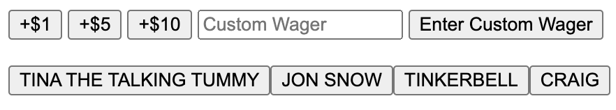
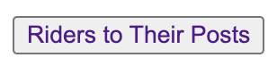
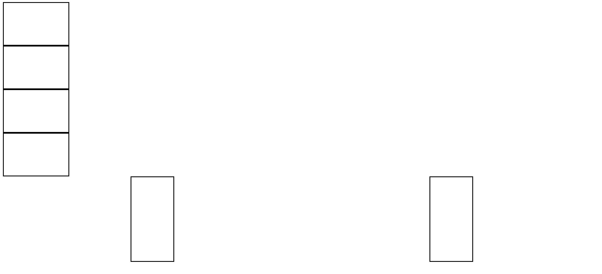
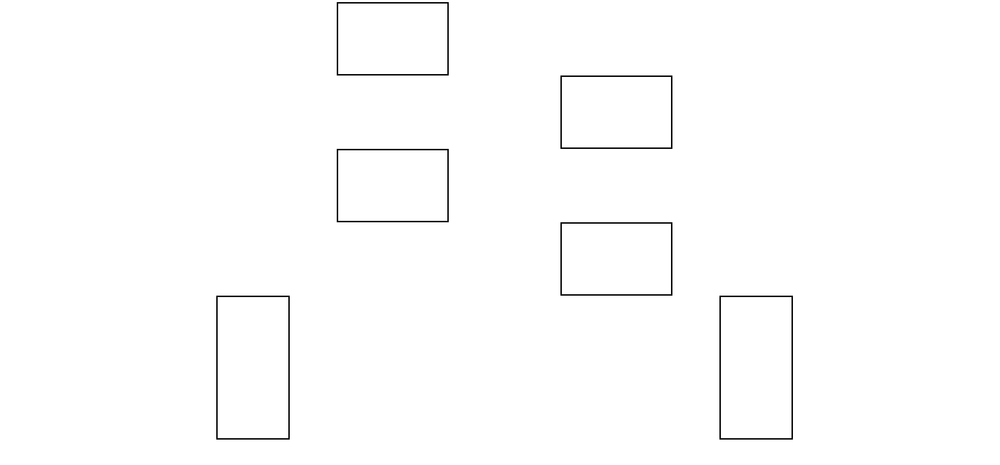
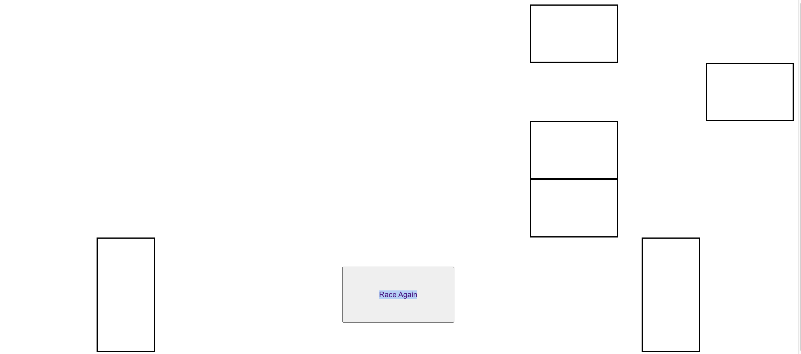

# Kentucky Derby

## Date: 07/08/2022

### By: Steve Morello

[GitHub](https://github.com/scubastove4) | [LinkedIn](https://www.linkedin.com/in/stephen-morello/) | [Twitter](https://twitter.com/scubastove4) | [Trello](https://trello.com/b/3arBzRBG/kentucky-derby-7-8-22)

---

## **_Description_**

This project brings the world's most famous horse race right to your ~~table~~ desktop. A series of card flips will determine who will bring home the Garland of Roses... and more importantly the "money."

---

## **_Technologies_**

- HTML 5
- CSS3
- JS 6
- Git

---

## **_Getting Started_**

As you enter "Churchill Downs," you first pass by the stables, where you get to see (set) the horses who will be racing. There are 8 posts, so up to 8 horses can race at once. Upon determining who will be racing, head right next door to the betting kiosk. There you can determine how many points you and your friends would like to wager on each horse. When you are all satisfied with your wagers, send the ponies to the posts!

On the next screen your horses will be assigned a lane based on the order they qualified for the race. Click the deck of cards on the bottom left; a number that corresponds with a horse will be randomly selected. Whichever horse matches that number wil move forward 1 length. Whoever makes it 8 lengths first is the winner, and whoever placed their wagers on that horse collects all of the losers points!

## **_Screenshots (Better Images Pending)_**

### Qualifying Horses & Making Wagers

### Time to Race!

---

## **_Task List(s)_**

| Future Updates                         | Completed Updates         | Canceled Updates                         |
| -------------------------------------- | ------------------------- | ---------------------------------------- |
| Choose race track option               | <!--:heavy_check_mark:--> | <!-- :heavy_check_mark: ~~Canceled~~ --> |
| Have horse slide across track          |
| Real-time weather affecting background |
| Run the Triple Crown                   |

## **_Credits/Resources_**

| Images                                                                                                                                                                       | Tecnhical                                                                                          |
| ---------------------------------------------------------------------------------------------------------------------------------------------------------------------------- | -------------------------------------------------------------------------------------------------- |
| [DuckDuckGo Kentucky Derby](https://external-content.duckduckgo.com/iu/?u=https%3A%2F%2Fimg.covers.com%2Fcms%2Fcovers%2Fba2c2dec-b1cd-4104-931c-337f4df39e09.jpg&f=1&nofb=1) | [Event Listener Delegation](https://youtu.be/XF1_MlZ5l6M?t=803)                                    |
|                                                                                                                                                                              | [Session Storage Use 1](https://youtu.be/0eV-tf-W2rQ?t=320)                                        |
|                                                                                                                                                                              | [Session Storage Use 2](https://www.javaguides.net/2019/05/javascript-sessionstorage-methods.html) |

<!-- Add this image for front side of card https://media.istockphoto.com/photos/blank-playing-card-on-a-white-background-picture-id182393154?k=6&m=182393154&s=170667a&w=0&h=c2mrUWET1N7kWWio7wS3Xe4N2GpsMXIZpk2ZZkFRXPg= -->

<!-- And this for back of card https://www.vippng.com/preview/iwTTwww_circle/ -->
